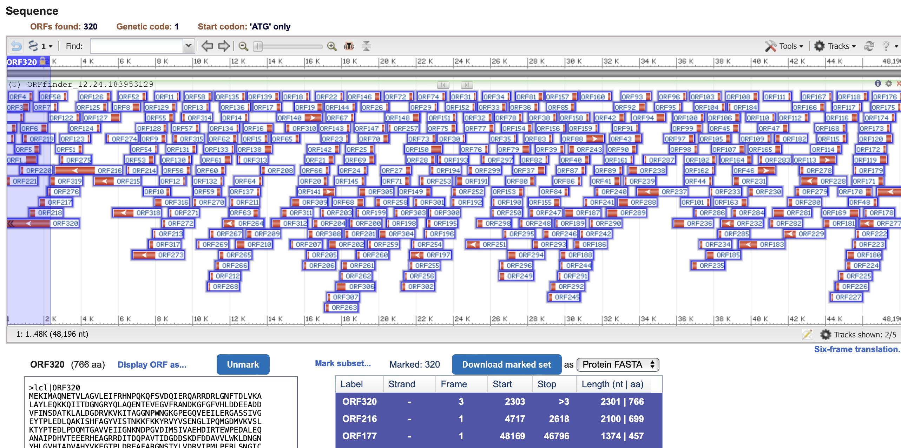

# Задача: аннотировать фрагмент генома бактерии и как можно точнее определить таксон, к которому бактерия принадлежит

## Выполнила: Долгодворова Маша
----
### Содержание:
- `files` - папка со всеми необходимыми файлами
  - `fragment10.fasta` - мой файл для работы
  - `__all.fa` - все рамки считывания (ОРС)
  - `blast_res.csv` - blastp по uniprot
  - `blast_NR.csv` - blastp по non-redundant

---
# Отчет

1. Получаем рамки считывания (OPC) по [ORFfined](https://www.ncbi.nlm.nih.gov/orffinder/)

2. 
