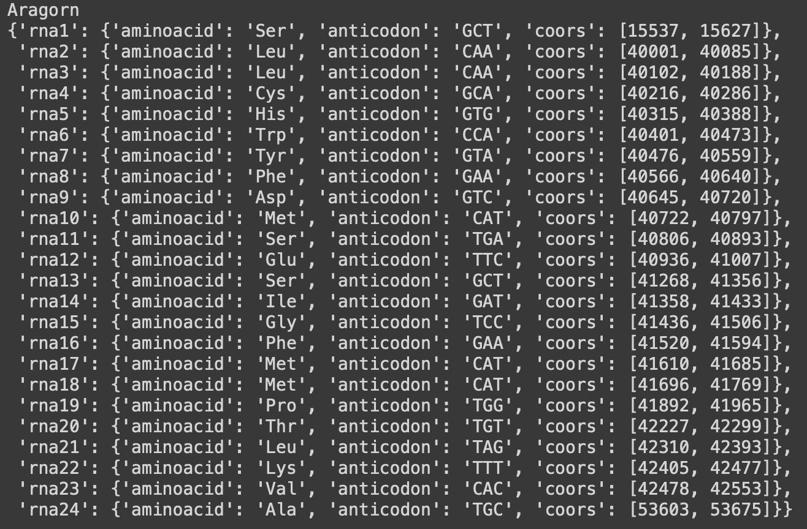

# Задача: аннотировать фрагмент генома бактерии и как можно точнее определить таксон, к которому бактерия принадлежит

## Выполнила: Долгодворова Маша
----
### Содержание:
- `files` - папка со всеми необходимыми файлами
  - `fragment10.fasta` - мой файл для работы
  - `__all.fa` - все рамки считывания (ОРС)
  - `blast_res.csv` - blastp по uniprot
  - `blast_NR.csv` - blastp по non-redundant
  - `aragorn.txt` - выдача [ARAGORN](http://www.ansikte.se/ARAGORN/)
  - `trna.fasta` - выдача [tRNAscan](http://lowelab.ucsc.edu/cgi-bin/tRNAscan-SE2.cgi)
  - также файлы, полученные samtools
 
- `images` - папка с необходимыми картинками

---
# Отчет

### 1) Получаем рамки считывания (OPC) по [ORFfined](https://www.ncbi.nlm.nih.gov/orffinder/)

### 2) Ищем гены по [BLASTP](https://blast.ncbi.nlm.nih.gov/Blast.cgi?PAGE=Proteins)

Сначала осуществляем поиск по Uniprot, в колабе скрипт для получения файлов с рамками считывания (`sorted_ORF.fasta`), результирующий файл я планировала прогнать по RefSeq, однако, результаты бласта выдавали пустой csv.

В итоге разбила файл на части (чтобы не падало из-за нехватки CPU) и прогнала по non-redundant. Собрав результаты, получила файл `blast_NR.csv`

### 3) Смотрим количество хороших находок
Берем порог по identity не менее 85, e-value меньше или равно 0.05, фильтруем (в т.ч. удаляем дупликаты и т.д.)

### 4) [tRNAscan](http://lowelab.ucsc.edu/cgi-bin/tRNAscan-SE2.cgi) и [ARAGORN](http://www.ansikte.se/ARAGORN/)

Точных пересечений не найдено, но в целом результаты вышли схожими (похожи координаты, аминокислоты). tRNAscan выдал на 4 находки больше.

